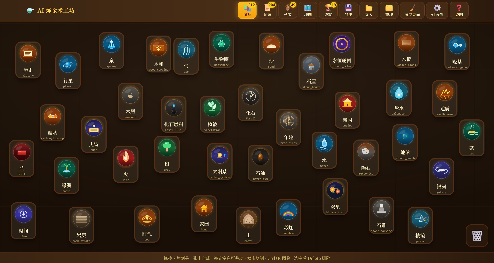

# AI 炼金术工坊

1. 介绍

这是一款以元素炼成为核心的网页游戏，灵感来自 Little Alchemy 和 Doodle God。你从火、水、气、土四大基础元素出发，把任意两张卡片拖到一起，就能炼出新的东西。至于会炼出什么，由 AI 现场推演——可能是顺理成章的化学反应，也可能是出人意料的联想。所有产物都会进入你的图鉴，成为这个世界的一部分。

2. 玩法

把一张卡片拖到另一张上，就会开始一次炼金。双击空白处可以召唤四大基础元素，双击卡片可以复制它。桌面上的位置会自动保存，下次打开还是原来的样子。

合成出来的元素会记录在图鉴里，随时可以查看它是什么、从哪里来、又能参与哪些合成。随着发现增多，世界地图会把所有元素和关系铺成一棵以「世界之心」为中心的树，点选某个元素就能看到它的来龙去脉。

游戏里还有一种消耗品叫秘宝。黑化能把一个元素拆解成组成它的具体事物，白化能把它净化成更抽象的概念，黄化负责精炼，赤化则让你说服贤者把一个元素点化成你指定的目标。秘宝用一次少一个，但发现足够多元素之后会不断获得。

当你解锁元素、类别、配方，或者发现某些特定的元素时，成就会自动达成并奖励秘宝。顶栏的「说明」按钮里有完整的操作介绍。

3. 构建

项目基于 Node.js 和 npm。克隆仓库后先安装依赖：npm install。本地开发运行 npm run dev，生产构建运行 npm run build，产物在 dist 目录。推送到 master 分支后，GitHub Actions 会自动构建并部署到 GitHub Pages。

首次使用需要在设置里配置 AI 接口，填写 Base URL、API Key 和模型名，合成才能开始工作。

4. 鸣谢

玩法灵感来自 Little Alchemy 与 Doodle God。界面采用中世纪羊皮纸与炼金术的视觉风格，标题字体为思源宋体（Noto Serif SC），笔记字体为霞鹜文楷（LXGW WenKai）。项目基于 React、Vite、Tailwind CSS 与 react-force-graph-2d 构建。
